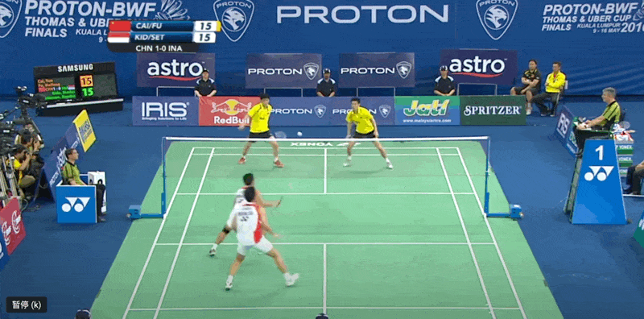
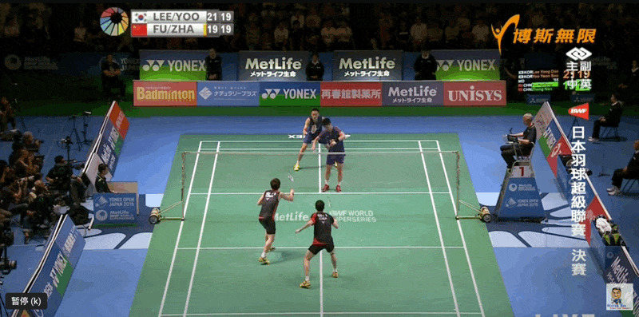
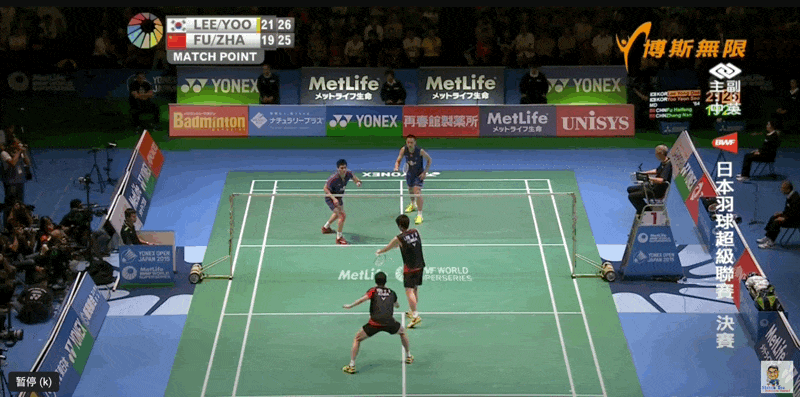
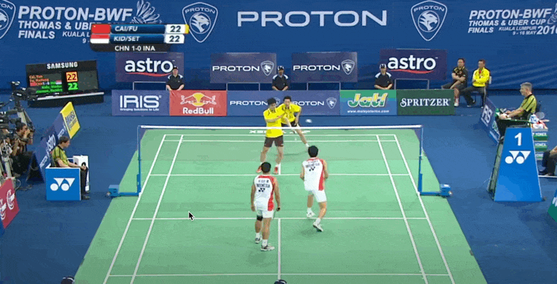
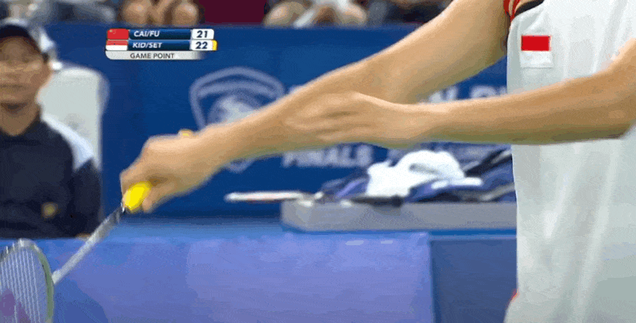
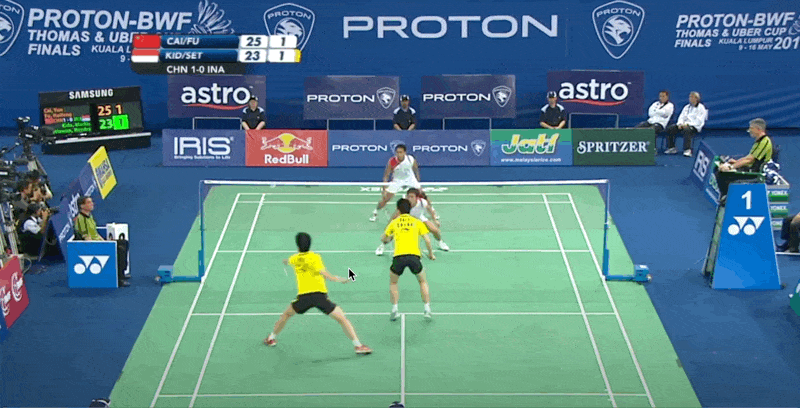

# 羽毛球双打技术动作

## 正手前场切腰 （左撇子）

## 反手前场切腰 （右撇子）

## 反手中场切后场

## 正手杀球
目标球员: 吴蔚昇

## 正手收吊

## 正手吊球
[小红书参考](http://xhslink.com/7N0a0I)
- 吊球要抢高点
- 击球前不能掉肘
- 击球前动作与高杀保持一致

## 正手劈吊
- 轻劈
- 重劈

[小红书参考](http://xhslink.com/tlQg0I)

## 推球

[小红书参考](http://xhslink.com/SXif0I)
- 收少打多

## 放网

[小红书参考](http://xhslink.com/SXif0I)
- 收少打多

## 挡网

## 封网

## 挑球

[小红书参考](http://xhslink.com/SXif0I)
- 收少打多

## 正手勾对角

## 正手蹲打