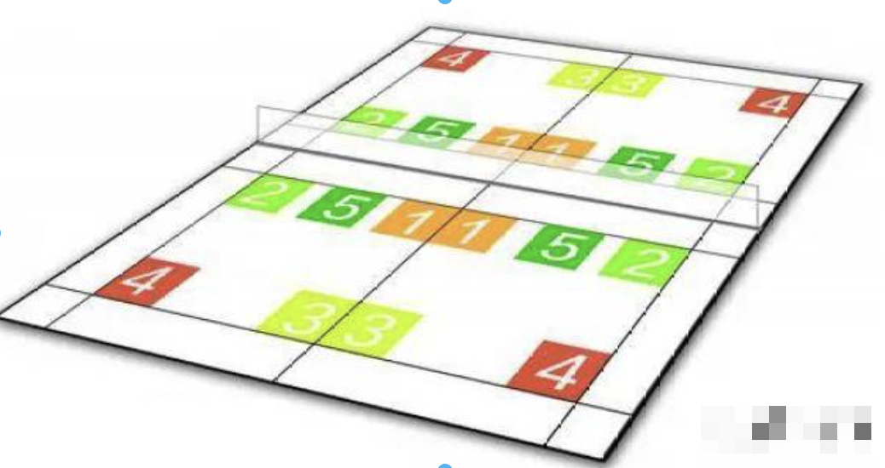

# 阿山-亨德拉 vs 李洋-李哲辉

## 比赛视频

<iframe width="100%" height="400" src="https://www.youtube.com/embed/CcJxj3a2aCQ?si=VRndQ395fnWDCAu6" title="YouTube video player" frameborder="0" allow="accelerometer; autoplay; clipboard-write; encrypted-media; gyroscope; picture-in-picture; web-share" referrerpolicy="strict-origin-when-cross-origin" allowfullscreen></iframe>

## 球路分析
<!-- examples -->
<!-- // [!code highlight] -->
<!-- // [!code warning] -->
<!-- // [!code error] -->

<p align="center"></p>

```diff:line-numbers
# 发球: 发2号区 -> 向T字区移动 -> 准备封网
黑毛: 右半区发2号位
# 前调: 不给封网机会 -> 2号区正手接发推底线技术 -> 第一次创造进攻机会
阿山: 正手推直线底角 

# 过渡: 不起高 -> 反手下压
黄毛: 反手直线下压
# 前调: 下蹲打法 -> 在不起高的同时创造进攻机会 -> 第二次创造进攻机会
阿山：下蹲正手快挡小斜线 // [!code highlight]

# 防守: 结合部过顶
黄毛: 正手挑高到结合部
# 前封: 头顶区起跳 点杀小斜线
阿山: 头顶正手下压直线

# 防守: 挑球 -> 平行站位, 压低姿态，准备接杀
黄毛: 正手挑直线准备防守 // [!code warning]
# 后杀: 杀球
亨德拉: 正手突击杀反手腰部 // [!code error]

# 防守: 球不到位，出现失误
黄毛: 反手推直线 // [!code warning]
# 前封: 网前变线进攻！
阿山：抽斜线肩部位置 // [!code error]

# 防守: 回球出现失误
黑毛: 正手防守挡边线
# 前封: 得分
阿山： 反手斜线封网
```


<p align="center"></p>

```diff:line-numbers
# 发球: 发一号位准备T字区封网
阿山: 左半区发<1>号位
# 前调: 不给封网机会 推反手腰线
黄毛: 正手抢推反手腰线 // [!code highlight]

# 过渡
阿山：反手挡直线过发球线
# 过渡
黑毛: 正手挡发球线

# 前调: 推直线中场 调动后场选手
阿山: 反手挡直线腰线 // [!code highlight]
# 过渡: 一步起跳，吊中场
黄毛: 向右前侧移动正手轻杀另一球员胸位 // [!code highlight]

# 过渡: 反手轻挡过发球线
亨德拉: 反手软挡中路 // [!code highlight]
# 过渡: 正手挡
黑毛: 正手挡小斜线

# 过渡
亨德拉：反手挡过网
黑毛: 正手推结合部

# 过渡
阿山: 正手快推直线过顶
# 下压
黄毛: 头顶下压直线底线 (界外) // [!code highlight]
```


<p align="center"></p>

```diff:line-numbers
阿山: 右半区偷4号区
黄毛: 蹬地侧身后撤正手抽直线

阿山: 补位2号区进行封网 // [!code highlight]
黄毛: 正手高位推对角, 身体顺势左移

亨德拉: 中场起跳杀边线
黑毛: 反手抽结合区底线 (界内) // [!code highlight]
```

## 手上技术
- 正手推边线到底
- 正手腰位杀抽大对角
- 正手腰位收吊中路往前
- 正手网前扑球技术

## 规律1: 离心
- 对手往前走, 我方向后打
- 对手往后撤，我方往前吊
- 对手往右走，我方往左打
- 对手往左走，我方往右打

## 步伐
- 接反手腰线球，不要右脚在前

## 左半区接发球
发小球 (经常用)
- `5`接发球: 推人挡1切腰
- `1`接发球: 挡1推4推腰过人挡挡腰

## 右半区接发球
发小球 (经常用)
- `2`接发球: 挡2, 挡腰
- `1`接发球: 挡1, 推腰, 推4, 推人
- `5`接发球: 挡1, 切2, 推腰, 推4

偷后场 (偶尔用)
- `3`接发球: 压2, 压腰, 压4
- `4`接发球: 压2, 压腰