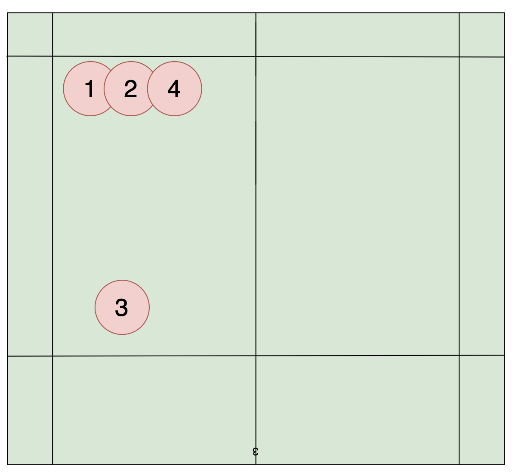
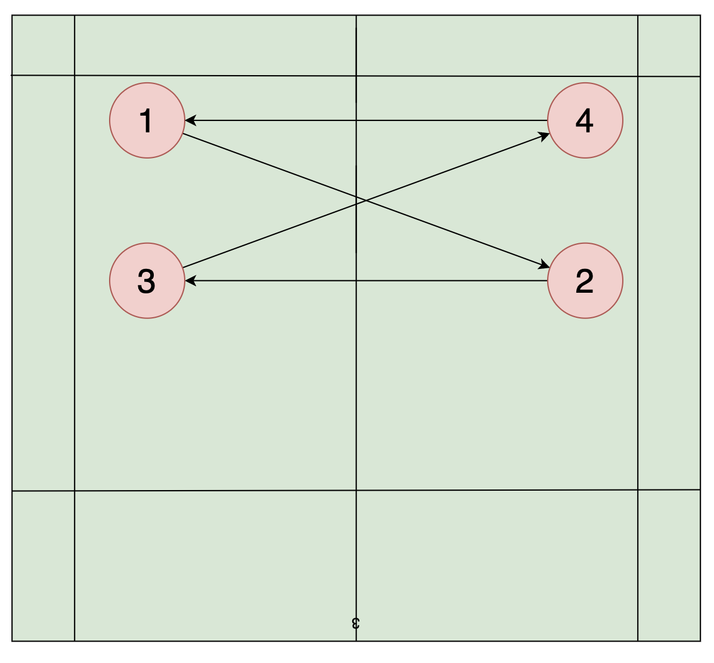
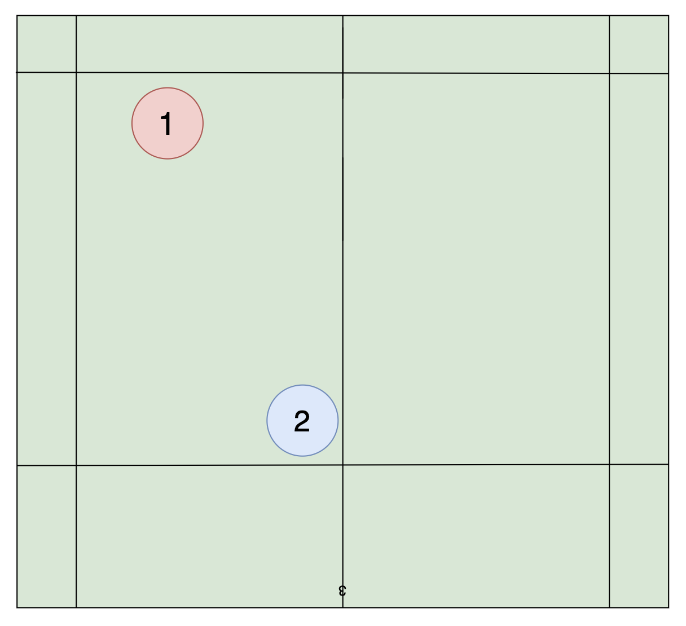
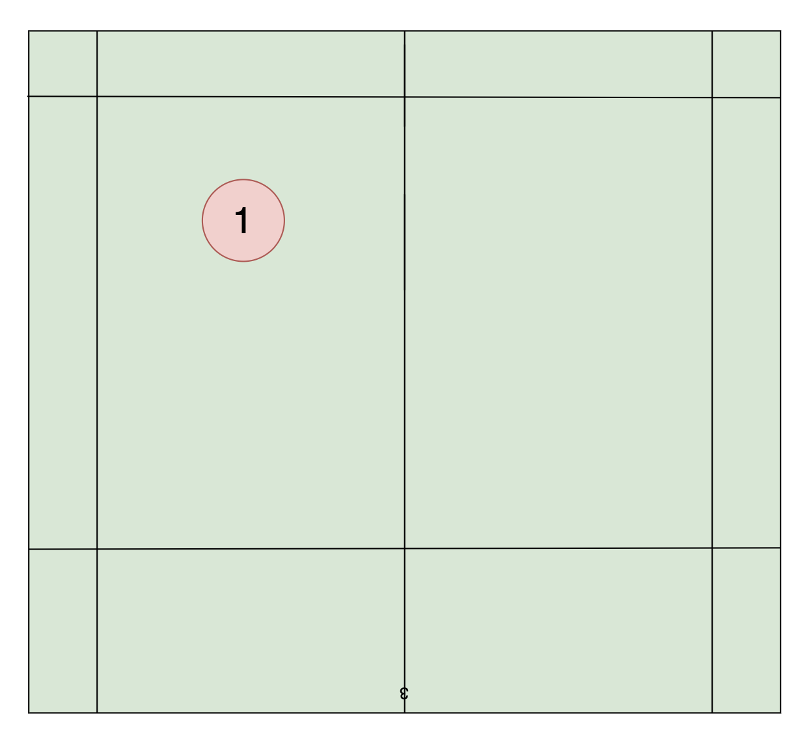

# 训练笔记 2024-04-30

## 训练内容
### 前后场直线连贯

- 吊两球
- 挡一球
- 杀一球

### 中后场对角连贯

- 杀球击球前手腕微微向后翻
- 注意杀球握拍，正拍面击打
- 中后场的球步伐基本只要一步
- 击打球后脚下回位要快

### 前封后杀配合

前场队员封
- 直线挡网
- 斜线平抽

### 接杀训练

- 脚下不要乱动
- 准备姿势手的位置不对
- 左右换位接杀不连贯

## 总结:
- 前后直线移动步伐提高
- 正手推球提高
- 杀球力量提高
