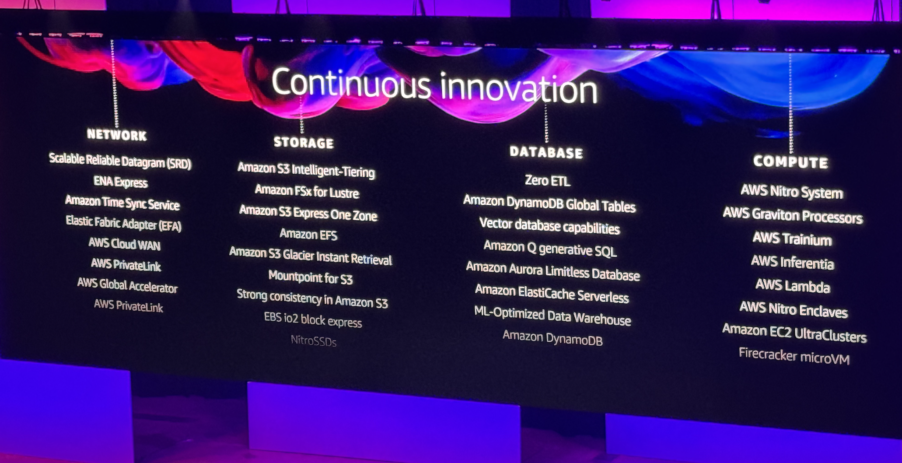
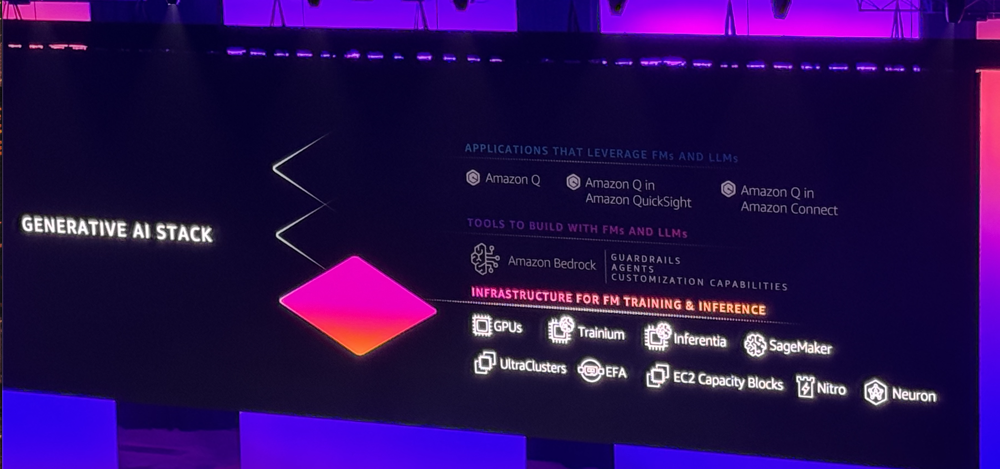
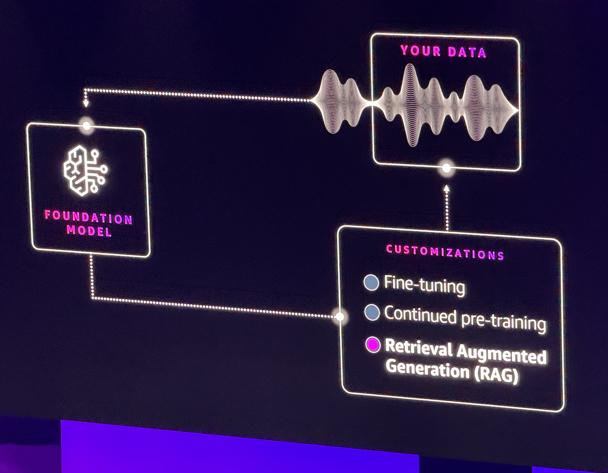
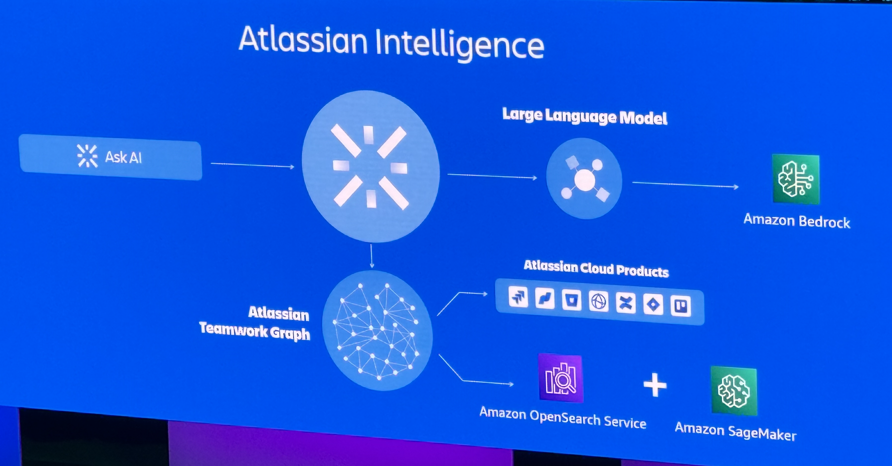

# AWS Summit 2024

## Application in AU & New Zealand
- Agriculture: insect -> fast, accuracy
- Medicine: find right therapy faster
- Leonardo.ai

## Investment
- infrastructure: data center in Melbourne
- infrastructure: New Zealand full region
- infrastructure: Amazon Bedrock: GDPR, Public Sector
- Education: free AI skills training globally in 2025
- Partners: Generative AI Partners.
- Security

## History
- 1947: computer
- 1983: TCP/IP & the Internet, Cloud Computing
  - network, storage, database, compute (IAAS)

- 2023: The AI Era
- 2024: AI Application in multiple industries and areas.

Case 1: [moderna](https://aws.amazon.com/solutions/case-studies/innovators/moderna/)

Bedrock Case: [lonely planet](https://shop.lonelyplanet.com/en-au)

> [!NOTE]
> Generative AI could replace human thinking and reasoning

## Leonardo.ai
- start from 6 people in 2024 
- content creation in global market
- 14.7 registered users (18 months)

 

- B2B: interactive team collaboration
- API feature

## Generative AI Stack

## Project Ceiba
AWS-built AI Supercomputer for NVIDIA internal R&D
- purpose-built CPU: [AWS Inferentia](https://aws.amazon.com/machine-learning/inferentia/)
- Canvas is building the own foundation design AI model

> [!NOTE]
> Amazon Bedrock is available in Sydney Region

> [!NOTE]
> Every modern business is a data business

## Atlassian Intelligence
- They launch the Virtual Assistant

- We could use Amazon Q Developer in IDE, specialized in AWS Documents like ask questions and generate code.
- We could use Amazon Q to talk with Enterprise Documents.
- The Amazon Q could learn our code in real time.