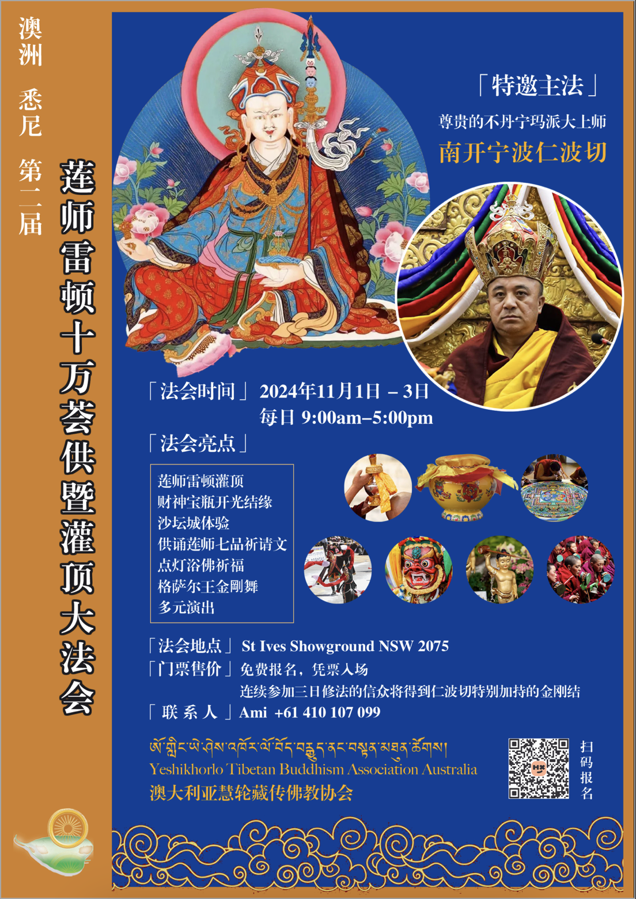

# 莲师雷顿十万荟供暨灌顶大法会

Date: 01.11.2024

## 声音
- 音响  @Jason ✅
- 1个调音台 @Naya ✅
- 有线话筒1 @Naya  + 话筒架子 ✅
- 无线话筒1 @Naya  + 话筒架子 ✅
- 无线话筒2 @Naya  + 话筒架子 ✅
- 无线话筒3 @Naya  + 话筒架子 ✅

## 投影
- 投影仪 + 投影幕布 + 幕布支架 + 挂钩 + 挂绳  + HDMI 15m @James ✅
- 投影仪 + 投影幕布 + 幕布支架 + 挂钩 + 挂绳  + HDMI 15m @James ✅
- HDMI 5m x1 @James ✅
- HDMI Splitter x1 @James ✅

## 电源 
- 电源延长线10m x 2 @James ✅
- 插排 x 4 @James @Naya  ✅

## 日程安排

| 周三                       | 周四                     | 周五           | 周六                 | 周日           |
| -------------------------- | ------------------------ | -------------- | -------------------- | -------------- |
|                            |                          | 上午：修法灌顶 | 上午：修法灌顶       | 上午：修法灌顶 |
| 下午: 取调音台、话筒、音响 | 下午: 舞台安装、设备调试 | 下午：修法灌顶 | 下午：修法灌顶       | 下午：荟供表演 |
|                            |                          |                | 晚上: 准备插座及话筒 |                |
