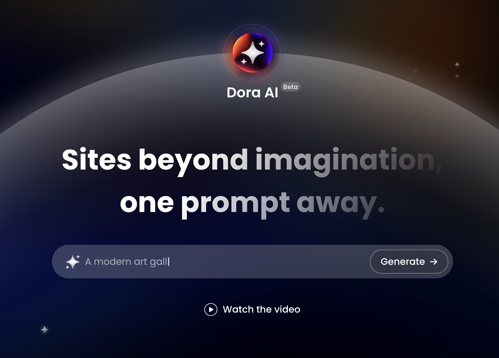
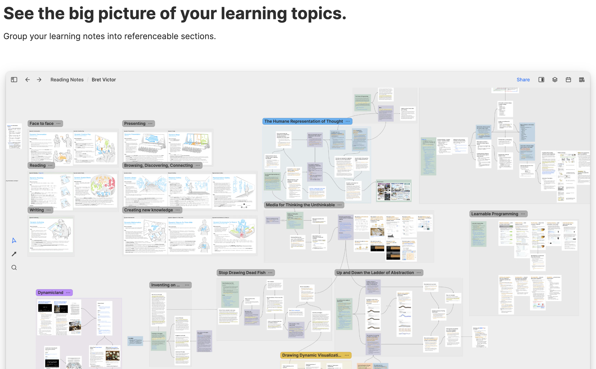
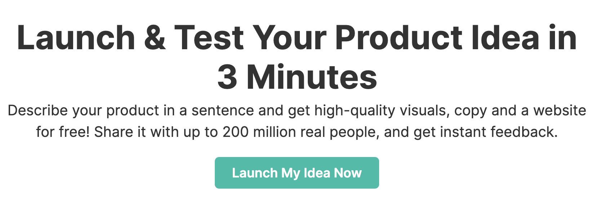
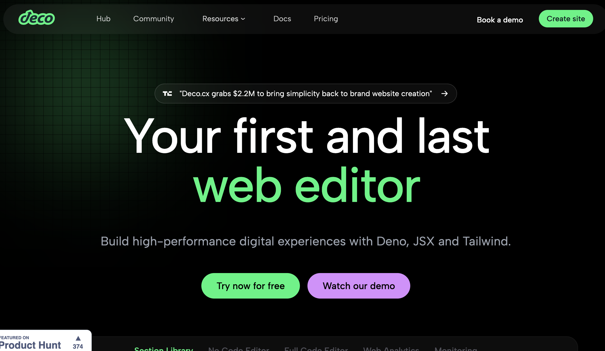
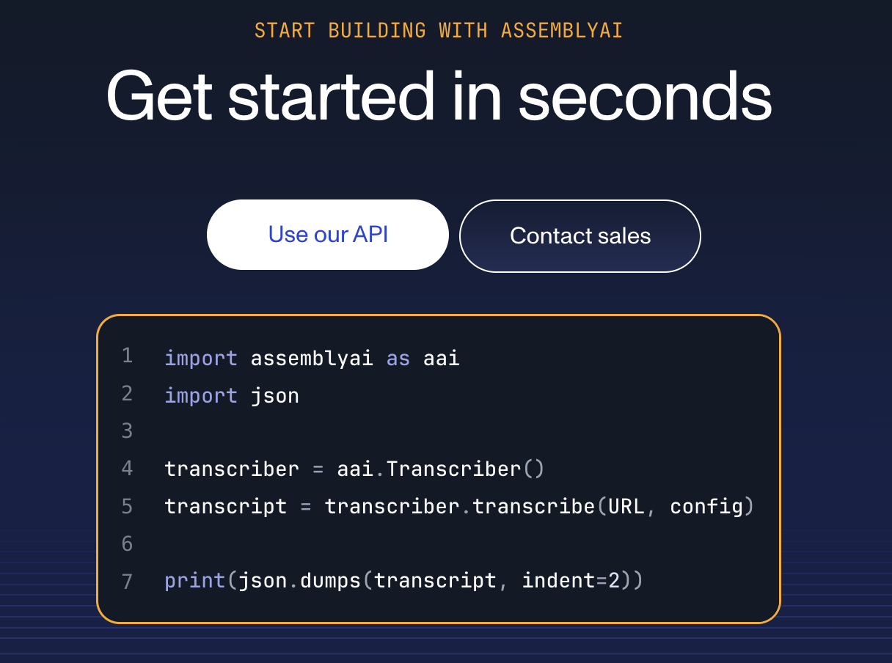
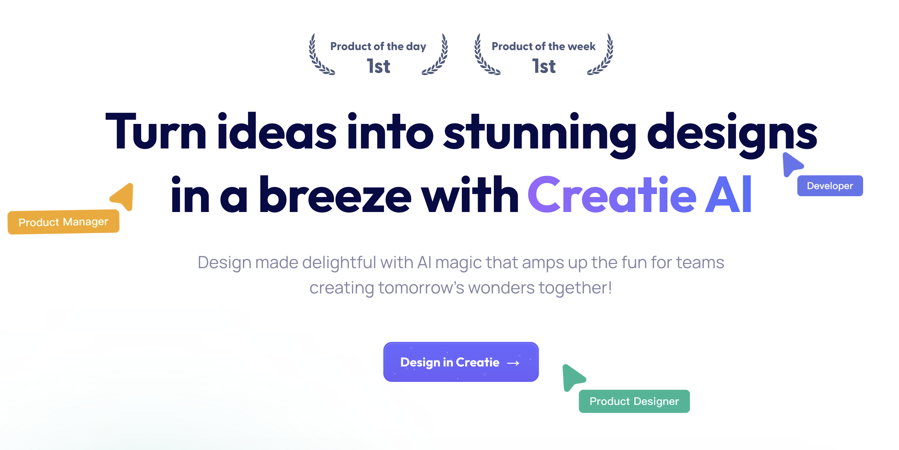
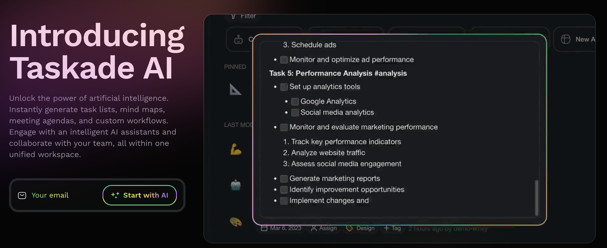

# Product Hunt 2023-2024

### Best Voted in 2023
- [Dora.ai](https://www.dora.run/ai): generate a website with only one prompt.

- [chat.d-id](https://chat.d-id.com/): Talk with a visual AI assistant.

- [Heptabase](https://heptabase.com/learning): The visual note-taking tool for learning complex topics.

## Best Voted Recently
- [Prelaunch AI Idea Validator](https://prelaunch.com/features/idea.html?utm_source=producthunt&utm_medium=ph&ref=producthunt): launch your ideas in 3 minutes.

- [Deco.cx](https://deco.cx/?ref=producthunt): Build web apps 10x faster with Deno, JSX, TS & Tailwind

- [AssemblyAI](https://www.assemblyai.com/discover/?ref=ph_home&utm_campaign=web_apr24&utm_medium=cpc&utm_source=producthunt): speech-to-text for voice data, speaker detection, sentiment analysis, chapter detection, PII redaction, and more

- [Heardeer](https://www.heardeer.com/?ref=producthunt): voice AI for interview.

- [guidde](https://www.guidde.com/): guidde is the generative AI platform for business that helps your team create video documentation 11x faster.

- [creative.ai](https://creatie.ai/?ref=producthunt): Turn ideas into stunning designs in a breeze

- [taskade](https://www.taskade.com/ai/app?ref=producthunt): Generate task lists, notes & mind maps + ChatGPT AI chat

