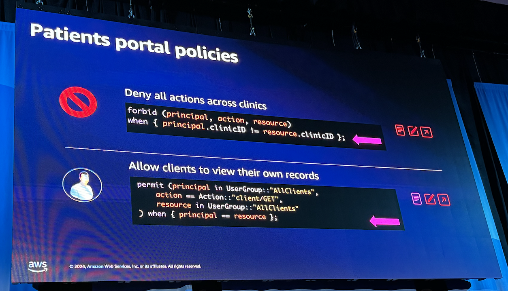
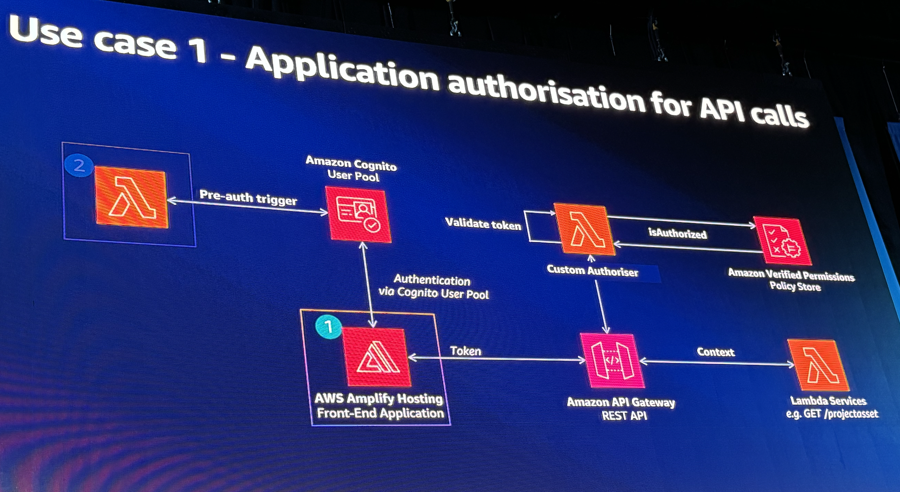

# Build Scalable Custom Authorization for Application in 30 minutes

## Overview of Authorization as a Service

- Why Authorization as a Service?
  - extracted from code
  - make audit easier
  - extra efforts like custom UI,etc
- [Amazon Verified Permissions](https://aws.amazon.com/verified-permissions/)

policy-based authorization:
- principal
- actions
- resource
- allow/deny

## Demo

- what does `context` mean here in AVP?
- what is the **policy store**?
- AVP will send audit data to **cloud trail**.
- how to accommodate **RBAC** & **ABAC**?
- build in Rust!
- Cost: Consumption based model.

### Use Cases

