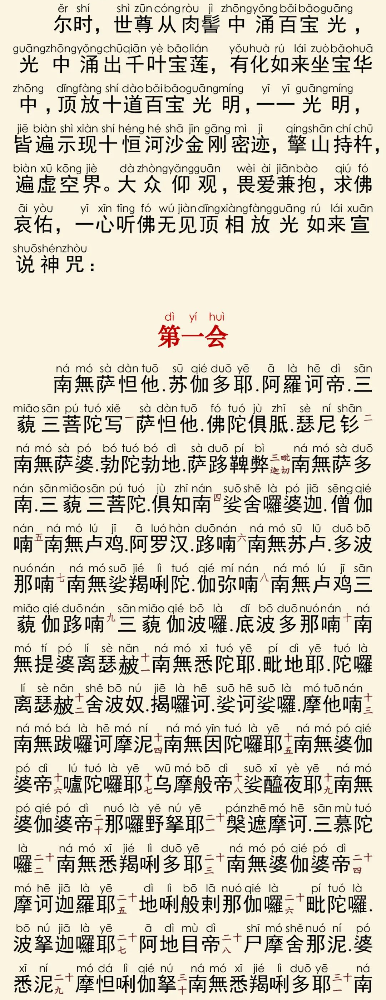
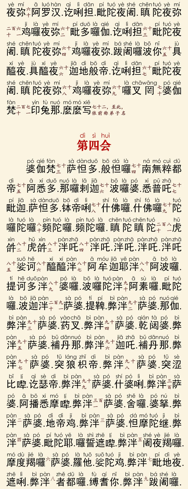

# 📿 楞严咒

---
<!-- 

 -->

<iframe width="100%" height="400" src="https://www.youtube.com/embed/bv-Ms2UEUw4?si=SGmvUicA0vIpBtai" title="YouTube video player" frameborder="0" allow="accelerometer; autoplay; clipboard-write; encrypted-media; gyroscope; picture-in-picture; web-share" referrerpolicy="strict-origin-when-cross-origin" allowfullscreen></iframe>

---- 

楞严心咒

(108遍)

嗡姆 阿纳雷 阿纳雷 维沙逮 维沙逮

维Rua 哇解拉 达利 班达班达你

瓦解拉巴尼 巴尼 怕德 虎姆 督汝姆 怕德 娑哈

<iframe width="100%" height="400" src="https://www.youtube.com/embed/16NFeh8MrWc?si=8TOEsejJz_loIC1u" title="YouTube video player" frameborder="0" allow="accelerometer; autoplay; clipboard-write; encrypted-media; gyroscope; picture-in-picture; web-share" referrerpolicy="strict-origin-when-cross-origin" allowfullscreen></iframe>

