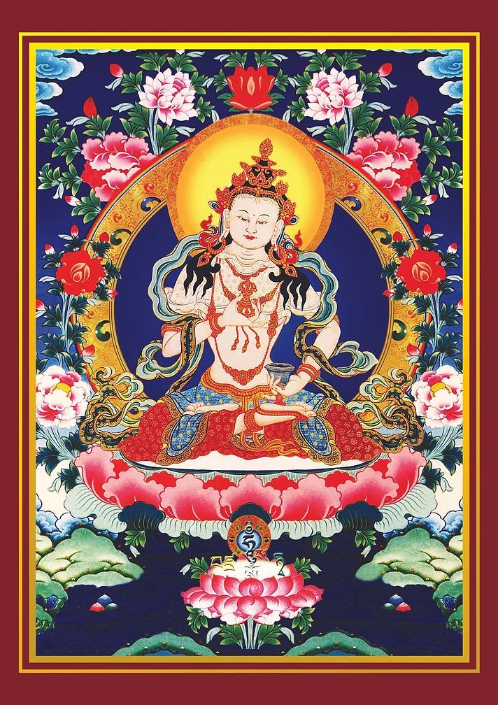

# 💫 圆满回向

<!-- 

 -->

回向文

愿我所修诸功德

回向众生得解脱

永离四苦三毒害

智慧如海证圆觉

功德大乐唯一源

愿佛教法恒住世

及诸乘愿持法者

长寿康健如胜帜

祈愿尊胜上师寿坚固

祈愿虚空有情乐且健

净障积粮自他悉圆满

祈愿我等速达佛境地

成就所愿誓言

以佛所获三身之加持 

法性不变真谛之加持 

僧众不退意乐之加持 

如是回向发愿悉成就

成就所愿咒

tadyathā pañca driya 

达雅塔 班赞 哲雅  

ava bodhanaye svāhā

阿瓦 波达呢耶 娑哈

金刚萨埵百字明

(3遍)

om benza sato samaya

嗡 班扎萨埵 萨玛雅

manupalaya

嘛努巴拉雅

benza sato tenopa 

班扎 萨埵 底诺巴

tishta dridho mé bhava

底叉 知桌 美 巴哇

sutokhayo mé bhava

苏埵卡约 美巴哇

supokhayo mé bhava

苏波卡约 美 巴哇

anurakto mé bhava

阿奴拉多 美 巴哇

sarva siddhi mé prayaccha

萨哇 斯德 玛 美扎雅匝

sarva karma su tsa mé

萨哇 嘎玛 速 杂 美

tsittam shreyang kuru 

则当 鞋央 格热

hung ha ha ha ha ho

吽 哈哈哈哈嚯

bhagavan

班嘎万纳

sarva tatagata

萨哇达他嘎达

benza ma mé muntsa

班杂 玛美 母杂

benzi bhava

班札巴哇 

maha samaya sato ah

玛哈 萨玛呀 萨埵 阿

缘起咒

(3遍)

om yé dharma       

嗡耶 达玛

hetu prabhava

黑德 抓巴瓦

hetun teshan

黑敦 得堪 

tatagato hyavadat

达塔嘎多 哈雅啊得

teshan tsa yo nirodha

得堪杂友 呢若达

evam vadi 

诶旺 巴德 

maha shramana soha

玛哈 夏玛纳 娑哈

