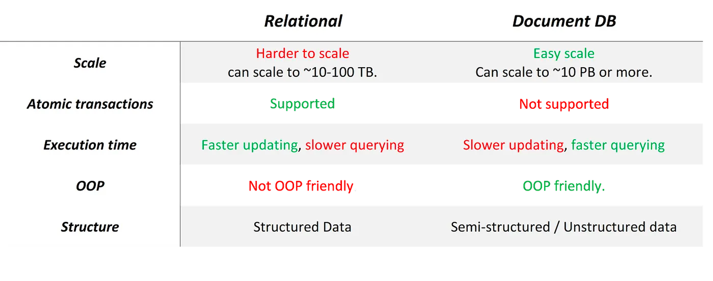

# Choose Database for Microservices

- duplicate data is welcomed if one system accepts eventual consistency

## Choose Right Database based on business requiments

## Database-per-Service Pattern

- each microservice should choose its own database that for best suit

## CQRS Pattern

- In order to achieve performant cross-services queries, we seperate read and write operation to query and command.
- after command database update, it will send an event, then query database will receive the event and update correspondingly.

## Event-Source Pattern

- store sequence of events in database and  could be replayed at any timepoint

## Saga Pattern

- to achive data consistency between microservices.

## Shared Database Anti-Pattern

- all microservices use one single database