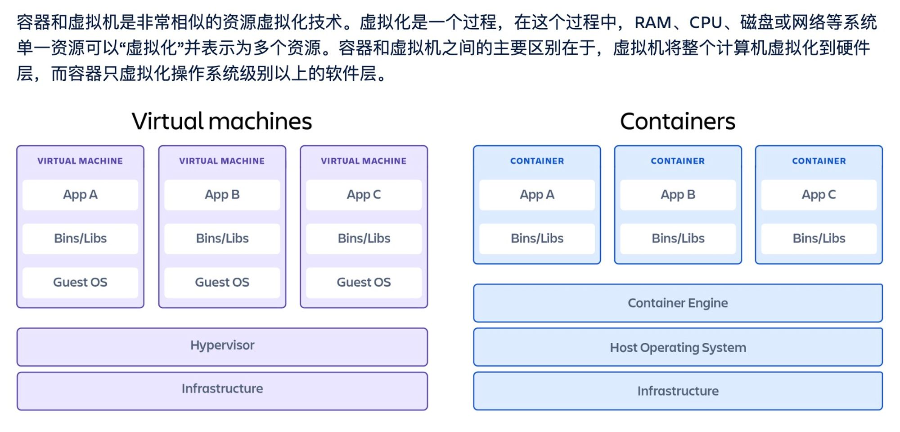

# Container

- A virtualize B means a create a mapping layer above

[容器与虚拟机 | Atlassian](https://www.atlassian.com/zh/microservices/cloud-computing/containers-vs-vms)

|              | VM                                                        | Container                               |
| ------------ | --------------------------------------------------------- | --------------------------------------- |
| Virtualize ? | hardware                                                  | os system (kernel)                      |
| Speed        | much faster start, destroy                                | slow                                    |
| Isolation    | relatively low, share the same kernel of operating system | very high, kernel is totally separated. |
| Space        | less                                                      | consume a lot of storage                |

## Docker vs Kubernetes

- Docker virtualize a single machine and allows deployment cross machines.
- K8s virtuaize infrastructure and allows deployment cross data centers and auto-scaling.