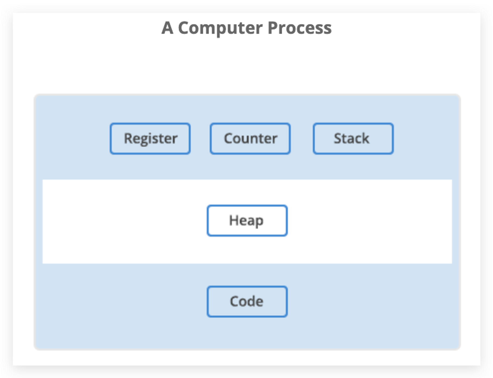
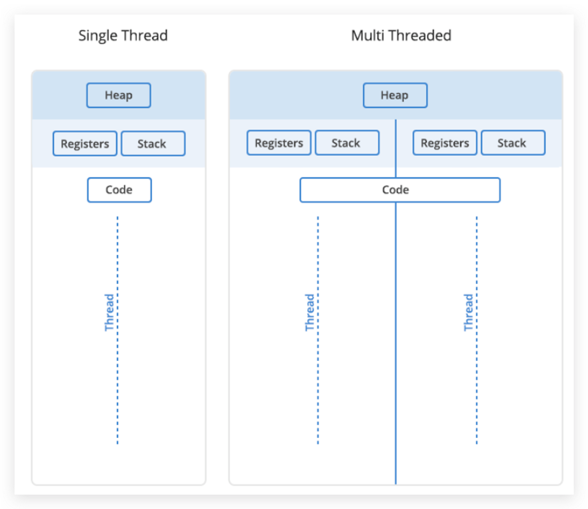
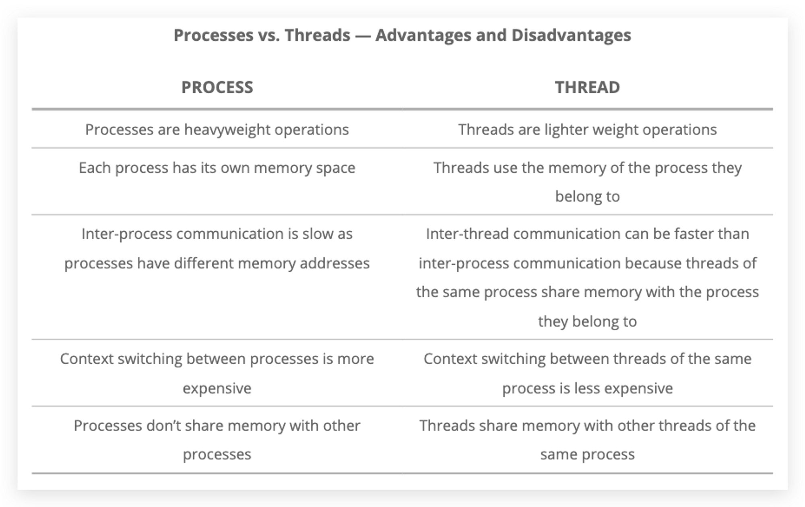

# Program vs Process vs Thread

### Program

> the code stored on your computer disk or non-volatile memory to fulfill a certain task. Including System Programs and Application Programs.
> 
- Program will be compiled or programmed to binary in memory before executing it.

### Process

> An instance of program that has been loaded into memory along with all the resources needed to operate. **A unit for resource allocation**
> 
- The **Operating System** handles the task managing the **resources** needed to turn program into processes.
- Resources includes:
    - **register**: some part of **CPU** to store `binary`
    - **program counter**: special `register` in **CPU** to do counter work
    - **stack**: data structure to store **local** and **small** things in memory, managed **automatically**.
    - **heap**: data structure to store **global** and **big** things in memory, managed **manually** or by **Garbage Collection**.
- Features:
    - **One** `program` may be associated with **many** `processes`.
    - **Independent** `Memory Address Space`.
    - `Inter-communication` is **expensive**.
    - `Robust`: One failed won't cause another to fail.

### Thread

> A unit of execution within a process. One process can have one up to many threads. **A unit to be scheduled and executed by OS**
> 
- Features:
    - Share the same `heap` in a process
    - Share the same `code` in a process
    - Has independent `registers`
    - Has independent `stacks`
    - Inter-communication is **less expensive**
    - **Vulnerable**: one fail can cause another to fail in the same process.

### Summary

- The program starts out as a `text` file of programming **code**.
- The program is `compiled` or `interpreted` into **binary** form.
- The program is loaded into `memory`.
- The program becomes `one` or `more` running **processes**.
- Processes are `typically` **independent** of each other
- While threads exists as the `subset` of a process
- Threads can talk with each other more `easily` than processes can
- Threads are `vulnerable` to problems caused by other threads in the same process.

<aside>
💡 对操作系统来说，线程是最小的执行单元，进程是最小的资源管理单元。

</aside>

### Tricks

### Reference

- [Stack and Heap](https://gribblelab.org/CBootCamp/7_Memory_Stack_vs_Heap.html)
- [Language C](https://gribblelab.org/CBootCamp/1_Why_Program_In_C.html)
- [进程线程协程](https://www.bilibili.com/video/BV1y7411d7dR)
- [漫画: 什么是协程?](https://www.itcodemonkey.com/article/4620.html)