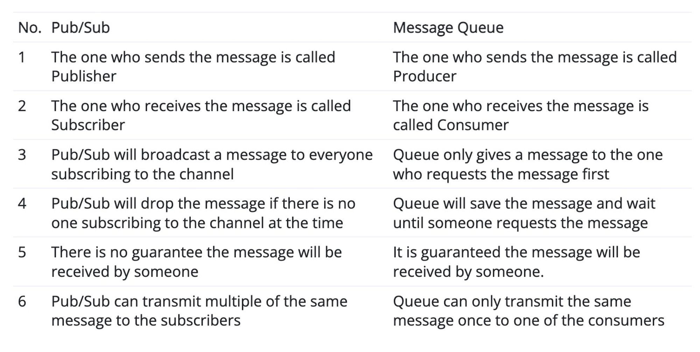

# PubSub vs MessageQueue vs Request & Response

| Name               | Solve                   | Use Case                                                                                              | Example            |
| ------------------ | ----------------------- | ----------------------------------------------------------------------------------------------------- | ------------------ |
| PubSub             |                         | broadcast one message to multiple listeners, and don’t care about how the message gonna be dealt with |                    |
| Message Queue      | asynchronous processing | task has unpredictable processing time and may used up server and network resources                   | Order at McDonalds |
| Request & Response |                         |                                                                                                       |                    |
- PubSub: don’t care about whether message is properly processed. 1-M (Publisher, vs Subscriber)
- Message Queue: care about message must be processed once and in right order. 1-1 (Producer vs Consumer)
  
