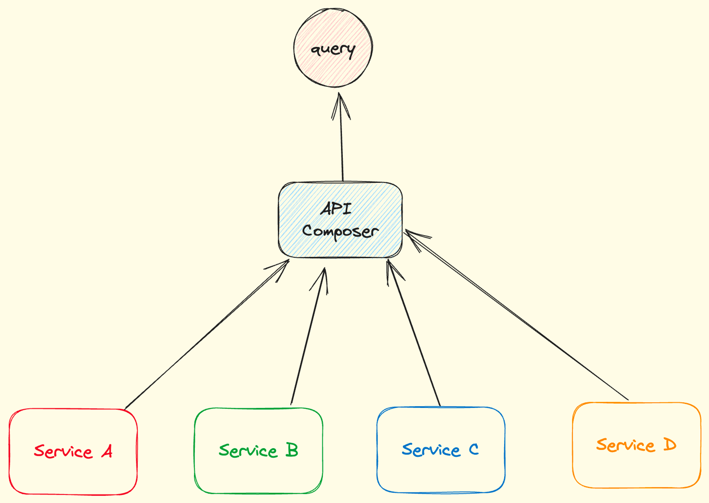
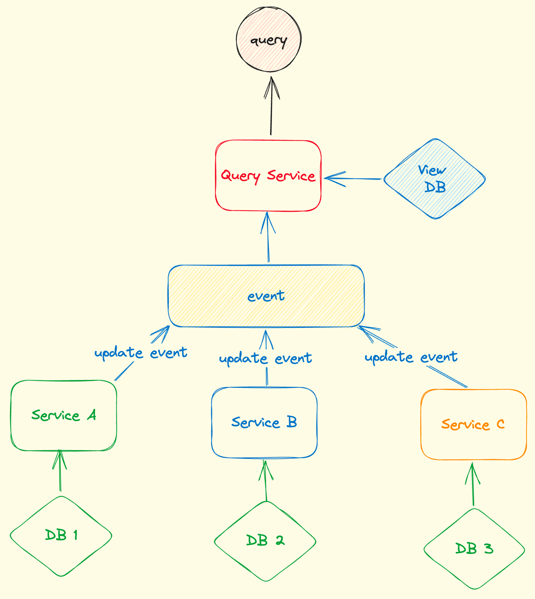
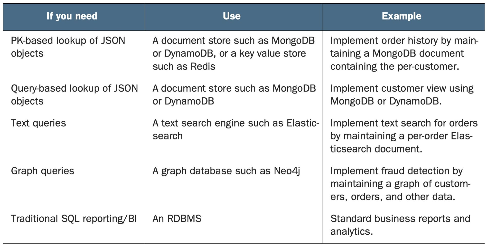
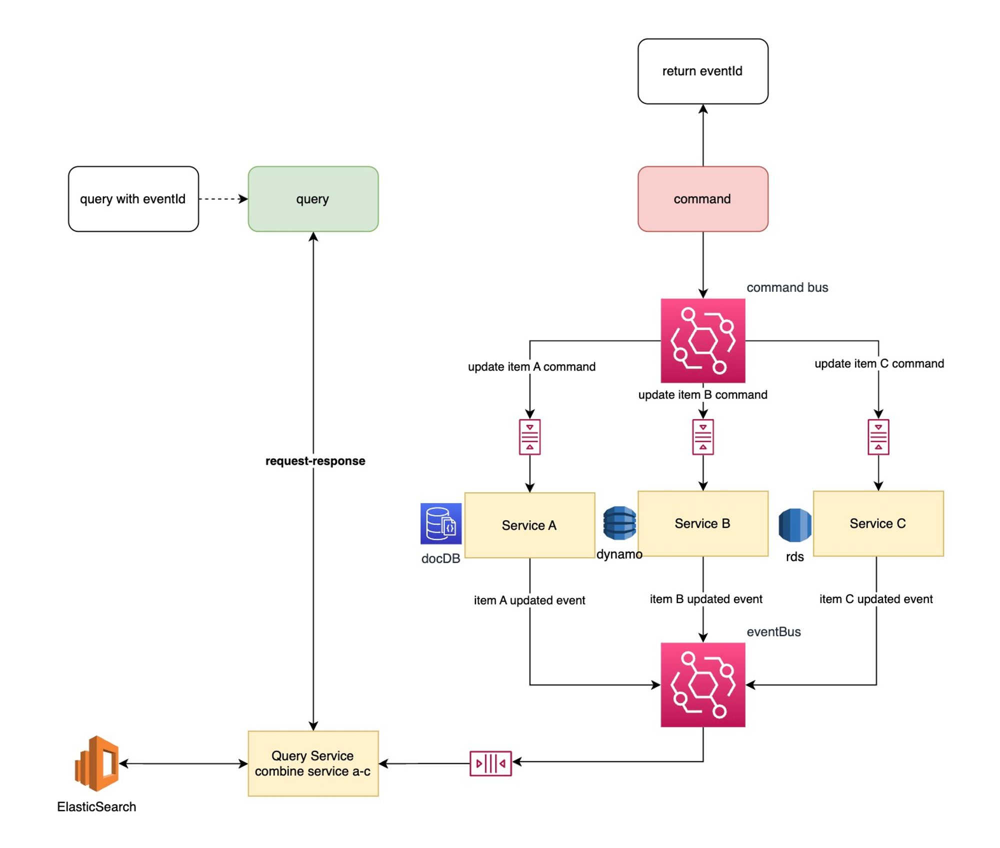
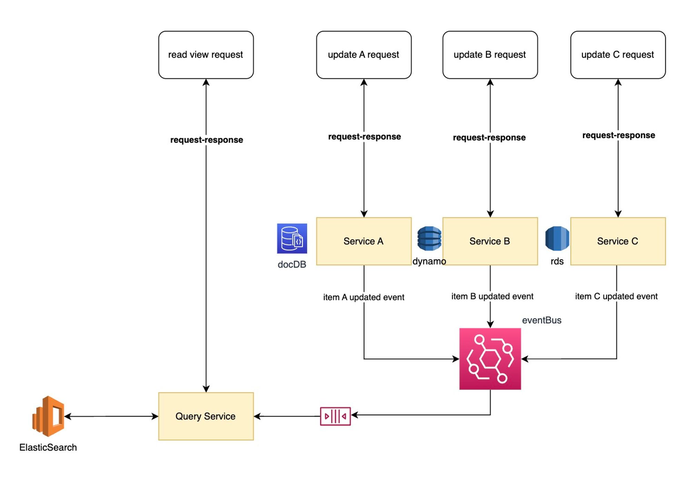
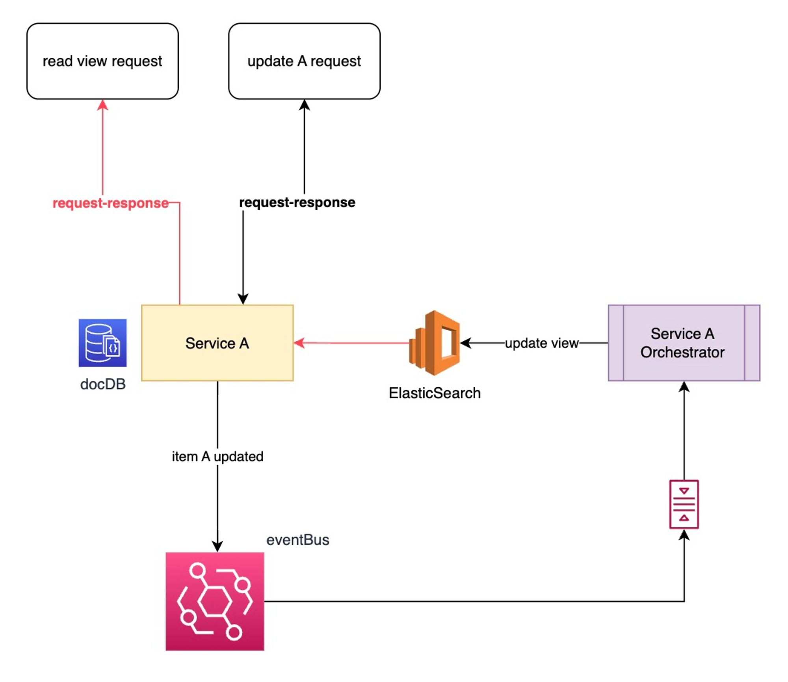

# Query in Microservice

In monolith, query could be simple and straightforward cause there is only one database and we could utilize database query to get all the information that we need.

But in micro service architecture, it is another story. Microservice uses data-per-service pattern. So one complex query always requires to get data from different storage.

There are 2 patterns to solve query in microservice architecture

- API Composition Pattern
- CQRS Pattern

## API Composition

### **Consideration** before using API Composition Pattern:

- Where to put the composer (The API Composer could be **Frontend Application**, **API Gateway** or **Backend For Frontend)**
- efficient aggregation logic (no complex join, should be simple and straightforward)

### **When**

- simple data aggretation for query.

### **How**:

- API Composer should be reactive, that could utilized rxjs **observables**.

### **Drawbacks**

- consumer more network and database connections
- lower availabilty: 95% * 95% * 95% < 95% (solution: cache or incomplete returned data)
- return data might have inconsistency between each pieces from different service.
- it’s not suitable to do complex in-memory join.

## CQRS (Command Query Responsibility Seperation)

Enterprice may use different database for query and write. For example, they will use ElasticSearch for test search but use RMDBS for mutating data.

### When

- API composition have complex queries, in-memory join, time-consuming queries (not efficient query).
- query that even hard or not possible to implement in composer (impossible query) cause some service doesn’t support that.
- seperation of concerns that the service owns the data should not be the one to query the data.
- eventual consistence is accepted for reading.

### What

- **Command**: create, update, delete
- **Query**: read (specific views), could utilize different database for efficient data view retrieve
- **Sync**: command side will emit event and query side will subscribe to sync data

### Design Query Service

- choose a proper database for specific data view requirements

- idepotent updates and solve concurrent requests (same message delivered twice)
- when updating view schema, need efficient way to rebuild view (**backilling**)
- how to deal with **replication lag**.

### Why no-sql is oftern good for query?

- nosql database has good read performance and flexible data schema
- nosql database drawback: simple transaction (we we don’t need to do update)
- sometimes we still need RMDBS for query (developer familiarity, reporting engine)

### What is Data Access Module?

- consists of Data Access Object
- DAO implements the update operation invoked by event handler
- DAO implements the query operation invoked by query module

### Handling simultaneoulu update using Locks.

- different message could be delivered to update the same record at the same time
- we need to create pessimistic or optimstic locks to avoid one overwrite another

### **Handling duplicate messages using the Idempotent consumer pattern**

https://microservices.io/post/microservices/patterns/2020/10/16/idempotent-consumer.html

- duplicate message could happen when **same message** deliver more than once (deadletter queue case
- some updates are ideopotent naturally, some are not, we need to make it ideopotent.

| Approach | Explanation | Prerequisite |
| --- | --- | --- |
| store eventId in seperate table | update transaction will include the update of the eventId in seperate table, if same eventId already exist, the transaction will abort (does not requires read before write) | Transaction is supported in DB |
| store eventIds in entity | store eventIds in the entity itself, when update, it will check whether current eventId is in the list of eventIds, if yes, abort, if no, processed. (requires read before write) |  |

### Enable clients to have eventually consistent view

- command will return an eventId immediately
- query will pass the eventId to get the view

## Diagram for Fully-Event-Driven CQRS Pattern

- command will return eventId immediately and client can use eventId to do the query (pull)
- send query in **eventual consistent** mode
- update operation subsribe to any command with queue needs to consider 2 things
    - **concurrency**: add p/o locks to entity
    - **duplicate events**: ideopotent update to entity

## Diagram for Half-Event-Driven CQRS Pattern

## Diagram for Minimum-Event-Driven CQRS Pattern

