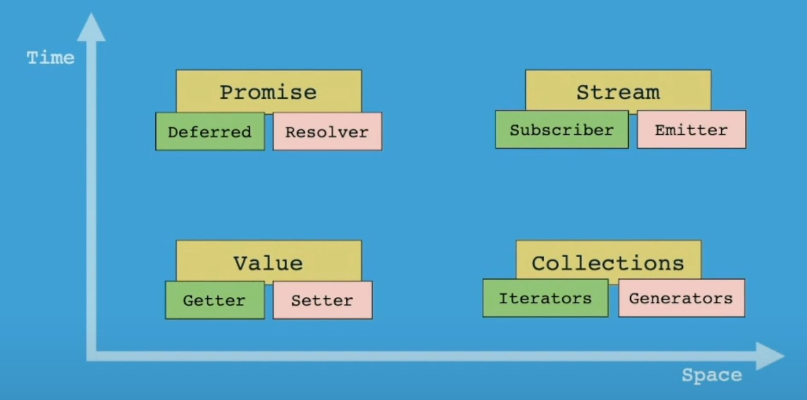

# Reactive Programming

> Programming with, or designing upon **asynchronous** data **streams**.
>

## Awesome Youtube on Evolution of Microservices.

<iframe width="560" height="315" src="https://www.youtube.com/embed/dB7LDiPKbPQ?si=Gc4eVyfuzGxV6f0d"
    title="YouTube video player" frameborder="0"
    allow="accelerometer; autoplay; clipboard-write; encrypted-media; gyroscope; picture-in-picture; web-share"
    referrerpolicy="strict-origin-when-cross-origin" allowfullscreen></iframe>