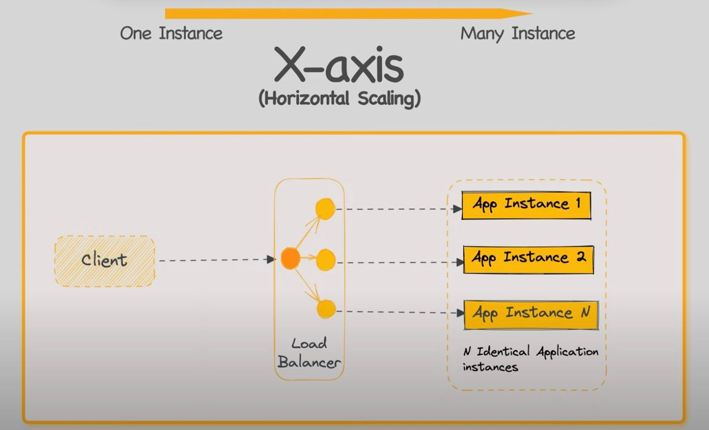
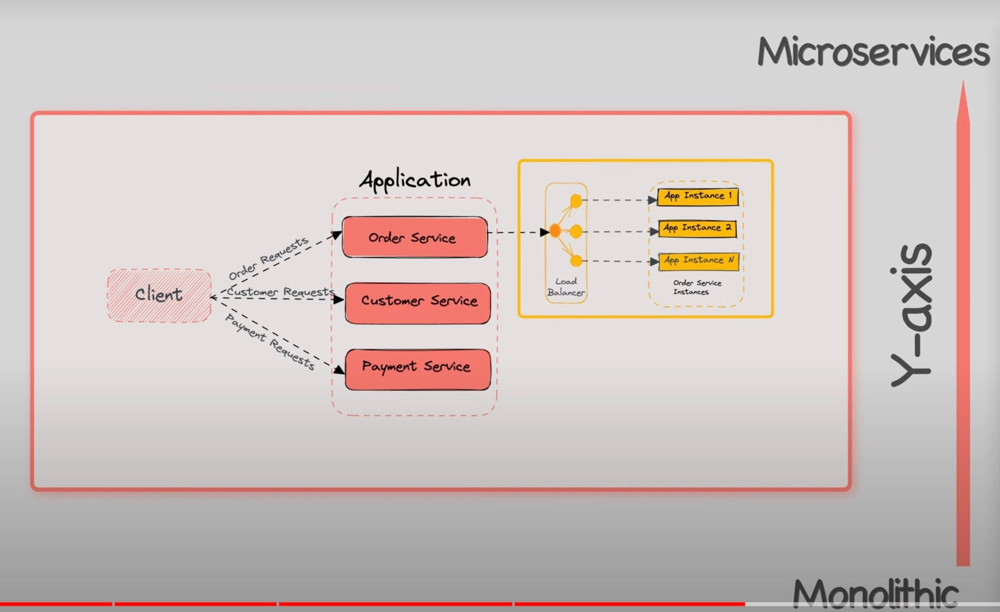
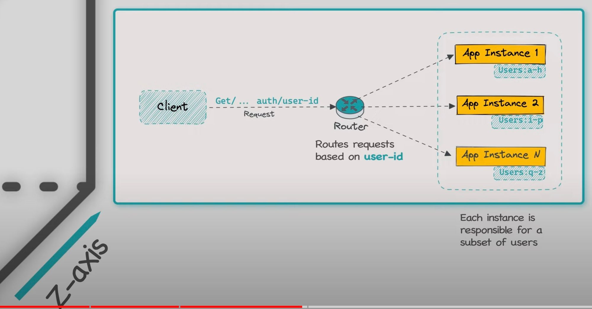

# Scale Microservices

## The Scale Cube

<iframe width="560" height="315" src="https://www.youtube.com/embed/q1RUnL4xTds?si=zzOCfDAkFtBi4oBz" title="YouTube video player" frameborder="0" allow="accelerometer; autoplay; clipboard-write; encrypted-media; gyroscope; picture-in-picture; web-share" referrerpolicy="strict-origin-when-cross-origin" allowfullscreen></iframe>

- X: horizontal scaling

- Y: spliting whole application by services

- Z: instance of server mapping to data sharding zone.
