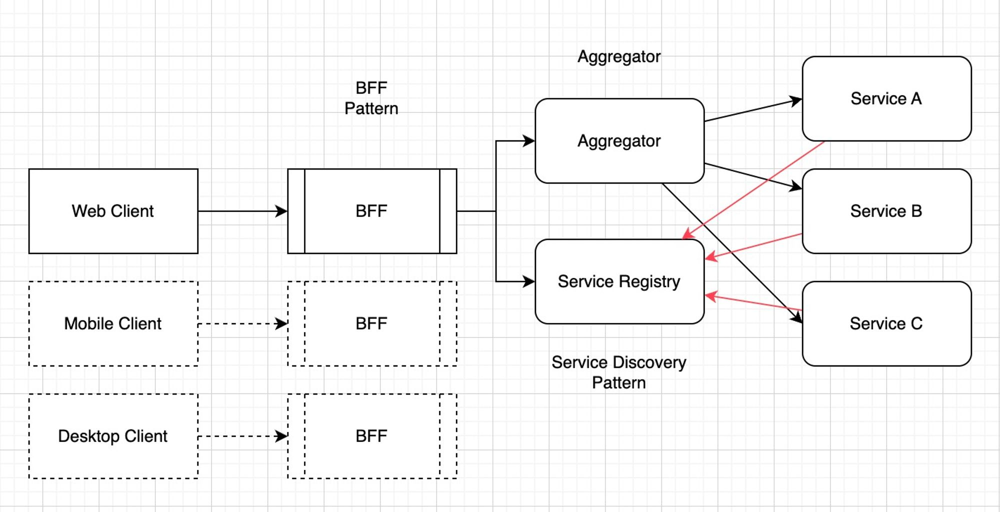
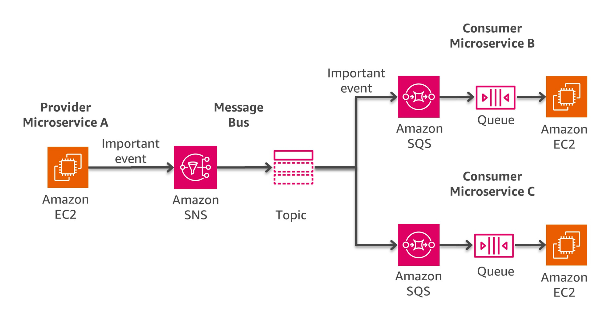
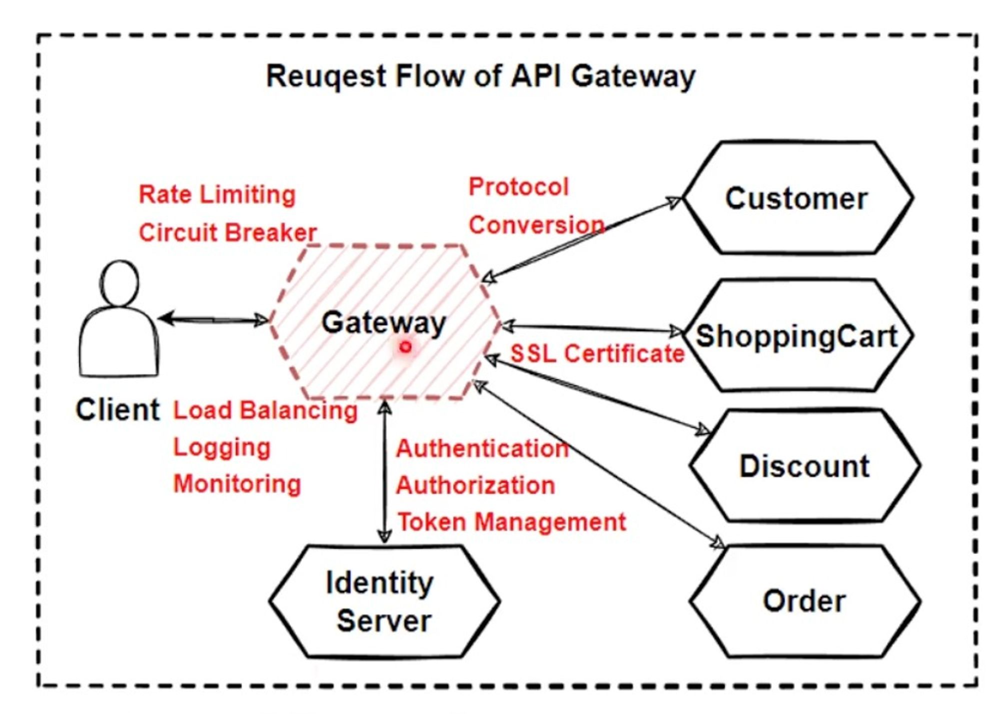

# Service Call Chain in Microservices

## Sync Communication

- send request and wait for response
- http, gRPC, graphql

## Async Communication

- send request and won’t wait for response
- one to one: using queue (RabbitMQ)
- one to many: using topic (kafka)

## Communication Styles

- request-response: http, gRPC, graphQL (REST)
- push: websocket (chat app)
- pull: http (waste of bandwidth, don’t scale well)
- event: (decoupled, each side doesn’t know each other, complex)

## Avoid Service to Service Chain Call

- **try to avoid internal service call chain as much as possible**
- **internal calls make service tightly coupled ,if one failed, all failed → not fault tolerant**
- **internal calls make the request delayed, lower scalability, availbality and performance**

### Solution A: API Gateway Aggregation Pattern

- suitbale for  short-time **predictable** request-response.

### Solution B: Make chain calls as async

- suitable for long-time **unpredictable** request.

## API Gateway Pattern

- client needs to make calls to multiple services. (data-per-service pattern)
- **cross-cutting concerns**: auth, rate limiting, ssl, logging, monitoring, circut breaker
- protocol difference: gatewate connect services with gRPC, but http with client
- **events**: frontend cannot publish events
- **flexible payload structure**: api gatewat could utilize graphql

### Gateway Routing Pattern

- single entry to route request to correct backend services (e.g. Apollo Gateway)
- and if service scaled in $Z$ axis, routing can do sharding for request

### Gateway **Aggregation** Pattern

- merge multiple requests to different backend serice into one request to gateway

### Service Registry and Service Discovery Pattern

- How API Gateway know the address of each services
- each service needs to register it’s location in Service Registry
- and API Gateway could use Service Discovery to find the location of each service

### Gatewat Offload Pattern

- implement cross-cutting concerns like auth, rate limiting, SSL, Logging, Monitoring, Load Balancing just in gateway, not in every service

### Single Point of Failure of API Gateway

- serveral clients connects to a single API gateway might have single point of failure.
- complex client applications will increase the complexity of API gateway which is an anti-pattern
- Solution: spliting single API gateway into several small APIs → Backend for Frontend Pattern
- Insights: Single Point of Failure → splitting into smaller pieces

### Backend for Frontend Pattern

- seperate API Gateway into smaller BFF which avoids the single point of failure

## Async Communication

- eventual-consistency must be acceptable

### Challenges:

- message broker: single point of failure
- it’s difficult to debugging.
- At-Least-Once message delivery and message order is not guaranteed

### Types:

- one-to-one: queue-based communication
- one-to-many: topic-based communication

### One-to-One Queue-based communication

- 1 Producer, 1 Queue,  1 Consumer
- Producer will send C**ommand** to Message Broker (Command Pattern)

### One-to-Many Queue-based Communication

- 1 Publisher , M Topcis and M Subscribers
    - Relates to Event-Driven Architecture Pattern

### Dependency Inversion Pattern (2 → 3 (decoupled)

- A depends on B → A depends on abstract C and B depends on abstract C
- queue or topic are the abstract interface in async communication

### Message Persistence Buffer

- No matter it’s 1-1 or 1-M asyn communication, we usually use **queue** to **buffer** messages (event with deadletter queue for debugging)

### Database is oftern the bottleneck of performance

https://medium.com/@nishantparmar/distribute-data-replication-partitioning-and-sharding-920a71481c1c

- seperate read and write and provides more read replicas
- sharding (horizontal splitting): split big database into smaller one by sharding key, it indirectly adds computing resources horizontally.