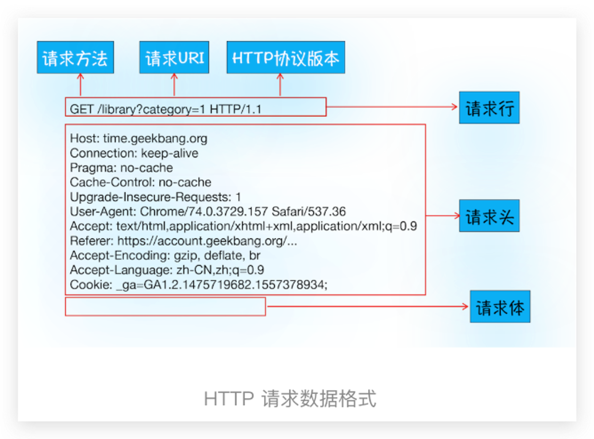
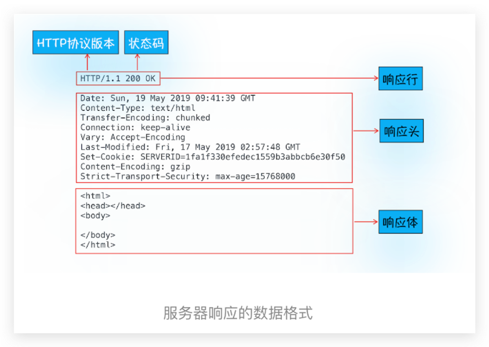
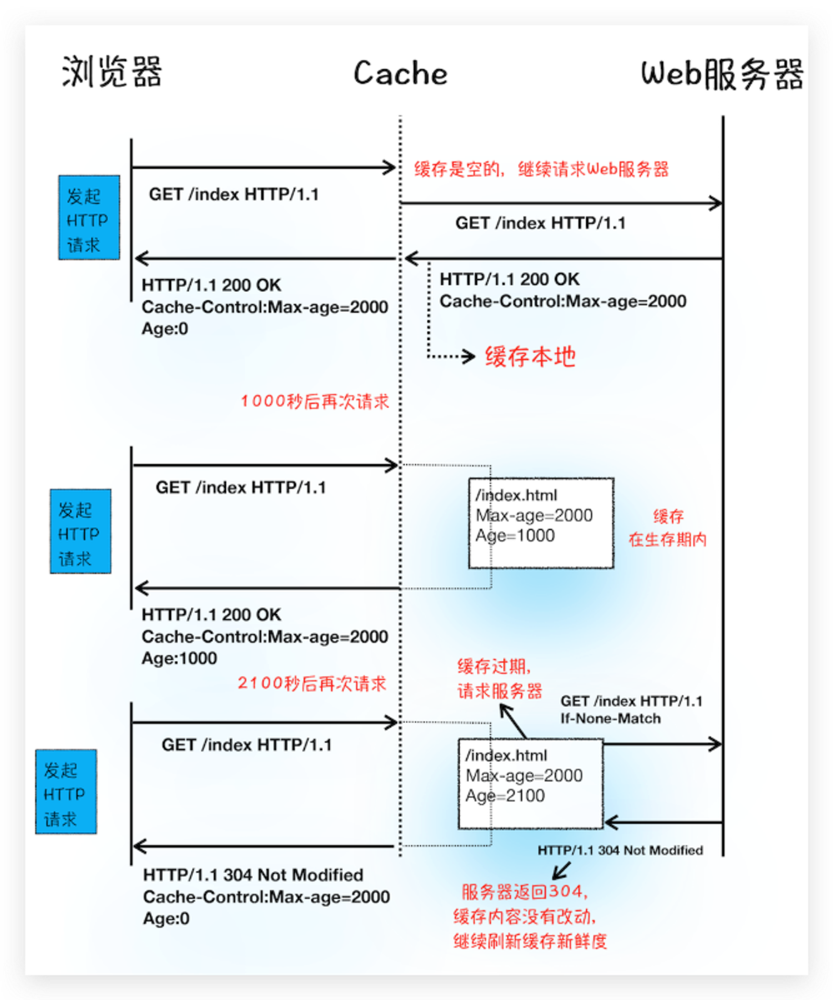
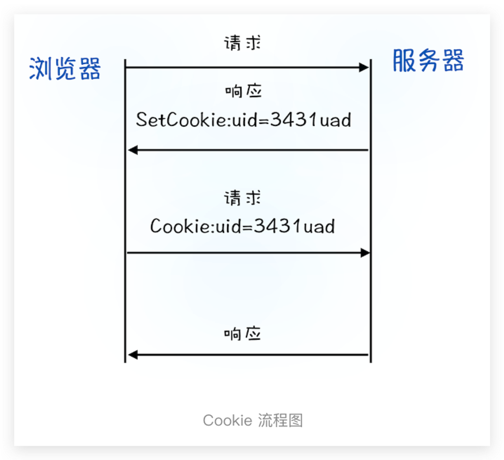
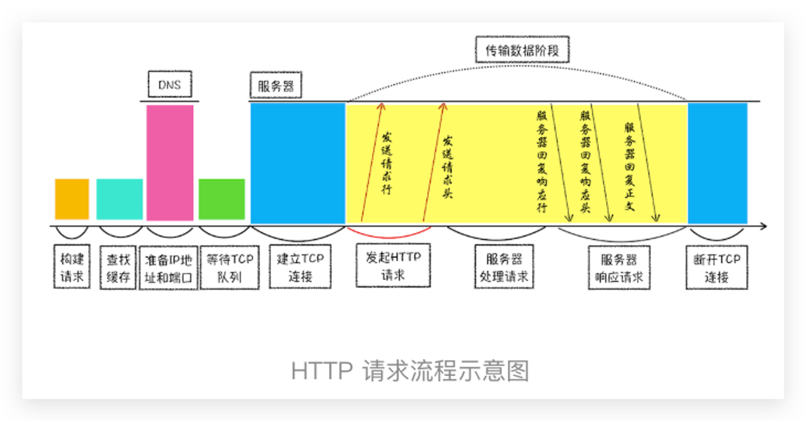

# How HTTP works

## Definition

> HTTP协议建立在TCP连接基础上，是一种允许浏览器向服务器获取资源的协议。

## Mechanism

1. 构建请求 `GET /index.html HTTP1.1`
2. 查找浏览器缓存，如果有则直接返回，没有则继续下一步
3. 查找DNS缓存，如果有则进行下一步，没有则请求DNS服务器
4. Chrome同域名最多6个tcp链接; 如果是第六个之后，则进入TCP队列进行等待，否则进行下一步
5. 建立TCP连接。进行3次握手
6. 发送HTTP请求

1. 返回请求

1. 或者重定向：如果响应状态吗是3xx, 则要进行重定向，导引到另外一个页面，要从1再开始
2. 最后断开或者保持链接： `Connection: Keep-Alive`的情况下要保持链接，否则正常断开链接

## Questions

- 为什么第一次访问站点时，打开速度很慢，再次访问时，速度就很快了？- **缓存**
    - 通过响应头中的`Cache-Control`来控制是`是否缓存`，`缓存周期`等等

- 当登录一个网站后，下次再访问该站点，就已经处于登录状态了？- Cookies
    - 通过响应头中的`Set-Cookie`来添加cookie，存储在请求头的`Cookie`字段中

## Summary

## Reference

- [03 | HTTP请求流程：为什么很多站点第二次打开速度会很快？](https://time.geekbang.org/column/article/116588)