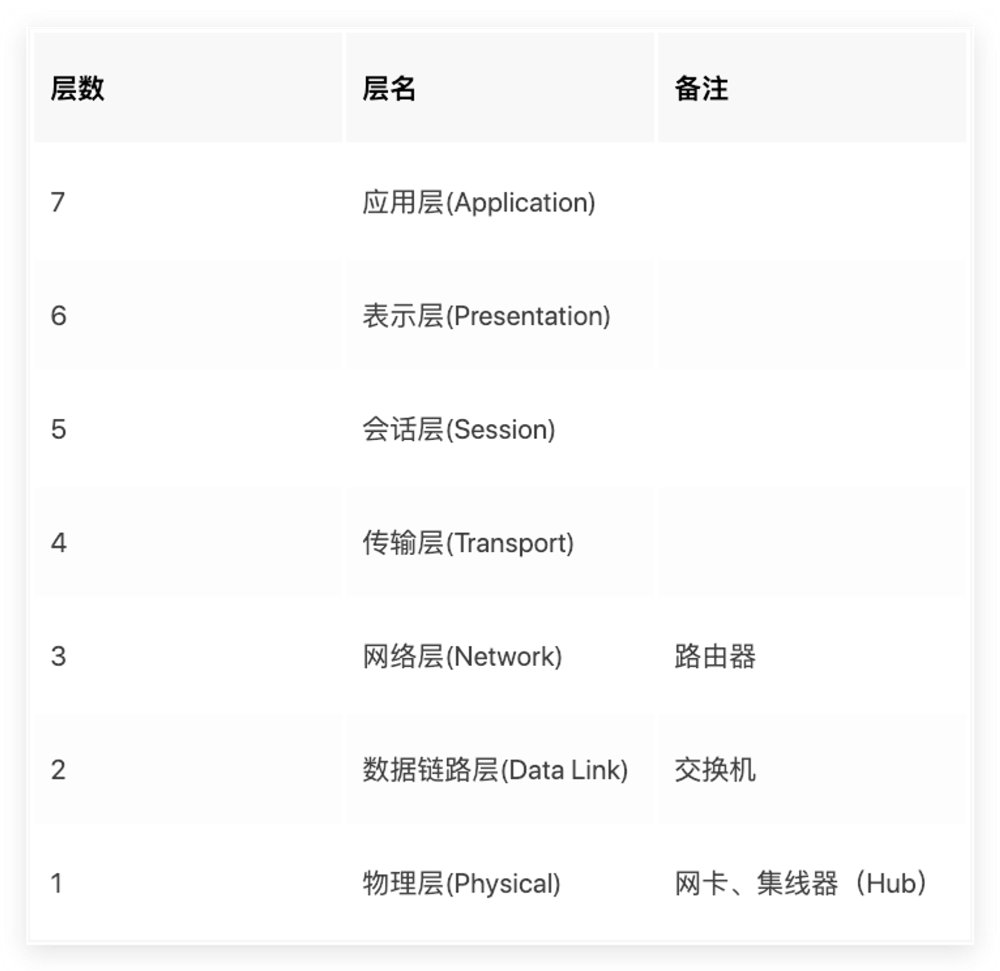
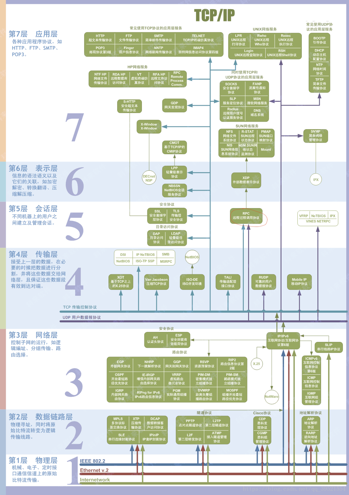

# OSI 7 Layers

**英语速记**：`All People Seem To Need Data Processing`.

## 第七层-Application

- 打开浏览器，需要DNS解析域名来获取对应IP；然后再通过HTTP来下载内容
- 包含协议: **DNS**, **HTTP**; **Websocket** FTP; DHCP; POP3: SMTP

## 第六层-Presentation

- 主要负责数据的转换，压缩和加密
- 包含协议: **SSL**

## 第五层-Session

- 会话指两个应用程序进程之间的逻辑连接；
- `会话层`提供用来创建、管理和终止会话的方法: **API**: `NetBIOS`, `RPC`, `Socket API`
- 同时负责管理和确定`传输方式`：
    - **单工(Simplex)**: 任何时间只能从A->B
    - **半双工(Half-Duplex)**: 可以从A->B,也可以从B->A,同一时间只能选择一个方向
    - **全双工(Full-Duplex):** 同时双向传输

## 第四层-Transport

- `TCP`: 可以一次性写入很多数据，自动分包；低速；可靠
- `UDP`: 不宜一次性写入太多数据，导致IP分段；高速；不可靠
- `TCP/UDP`通过`多路复用`和`多路分解`来**识别**和**标记**应用程序

## 第三层-Network

- 关心如何把数据从一个设备发送到网络里的另外一个设备，**WAN**， **路由器**
- **地址**、**路由**、分段、重组
- 包含协议：`IP`

## 第二层-Data Link

- 只关心如何把数据发送到**LAN**中: **交换机**
- 重要概念: **MAC**地址

## 第一层-Physical

- 硬件规范
- 编码信号
- **实际发送**

## Reference

- [网络分层TCP/IP 与HTTP](https://juejin.im/post/5a98e1f7f265da237410694e)