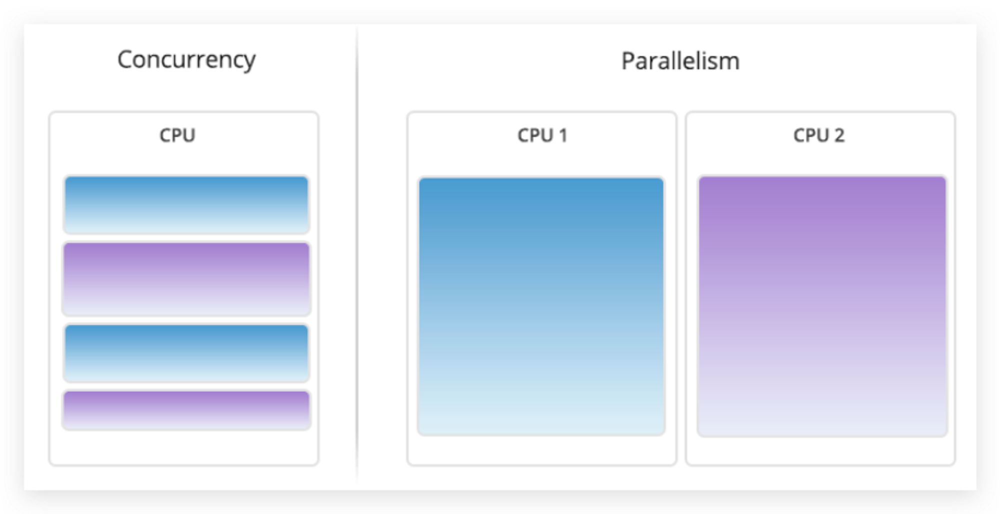

# Concurrency vs Parallelism

### Concurrency vs Parallelism

- Multiple CPU cores: Parallelism with genuine simultaneous execution
- Single CPU core: concurrency with interleaving of process in time to give appearance of simultaneous execution.

### Reference

- [Stack and Heap](https://gribblelab.org/CBootCamp/7_Memory_Stack_vs_Heap.html)
- [Language C](https://gribblelab.org/CBootCamp/1_Why_Program_In_C.html)