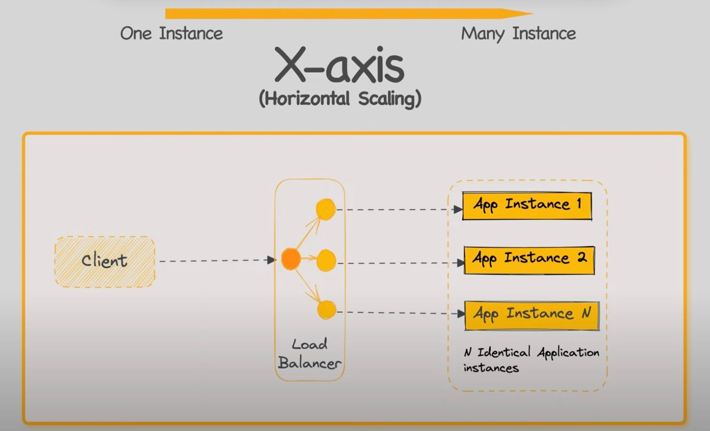
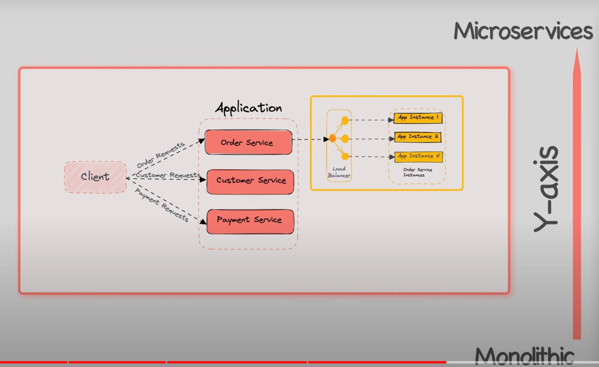

# Scale Microservices

## The Scalibility Cube

[https://www.youtube.com/watch?v=q1RUnL4xTd](https://www.youtube.com/watch?v=q1RUnL4xTds)

- X: horizontal scaling

- Y: spliting whole application by services

- Z: instance of server mapping to data sharding zone.
