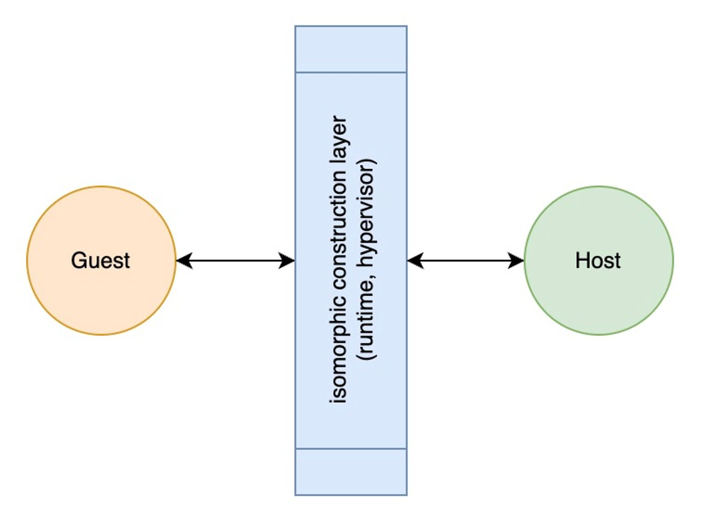
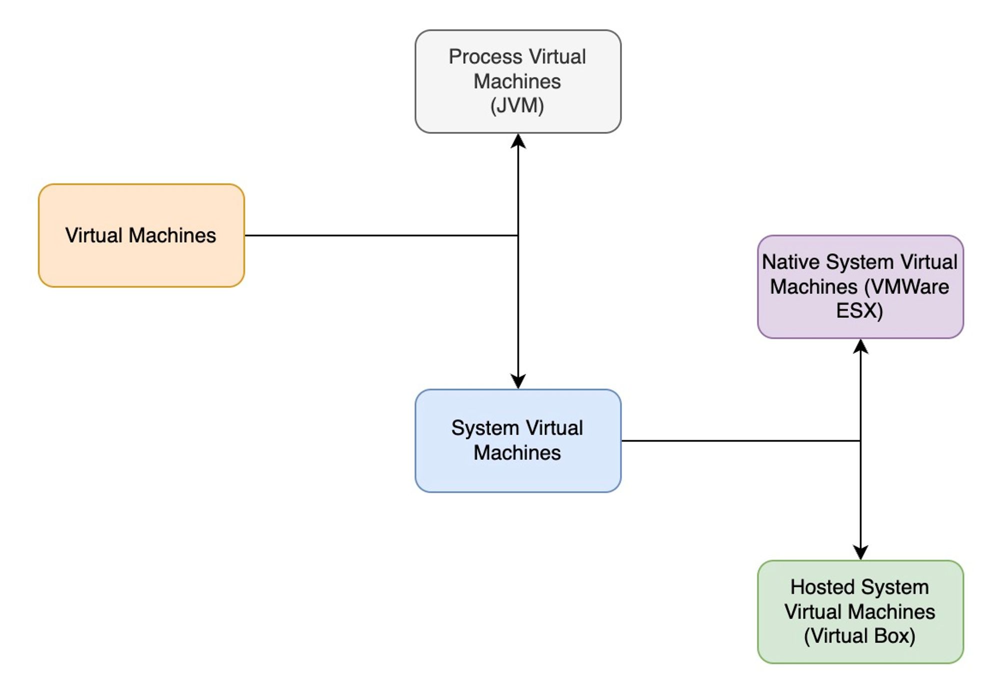

# Virtualization

## Isomorphic:

https://www.youtube.com/watch?v=BAmWgVjSosY&ab_channel=Socratica

直白解释: 两个东西结构完全一致 但是形态不同

## Virtualization

- Definition: Virtualization involves the construction of an ***isomorphism*** that maps a virtual *guest* system to a real (or physical) *host* system.

- One host can have Multiple guests
- Guests vary in **quantity** and **type**
- One Guest can be in only one host at the same time, but can be migrated to another at a different point of time.
- Catogory:

- Comparison betweeen Process Virtualization and System Virtualization