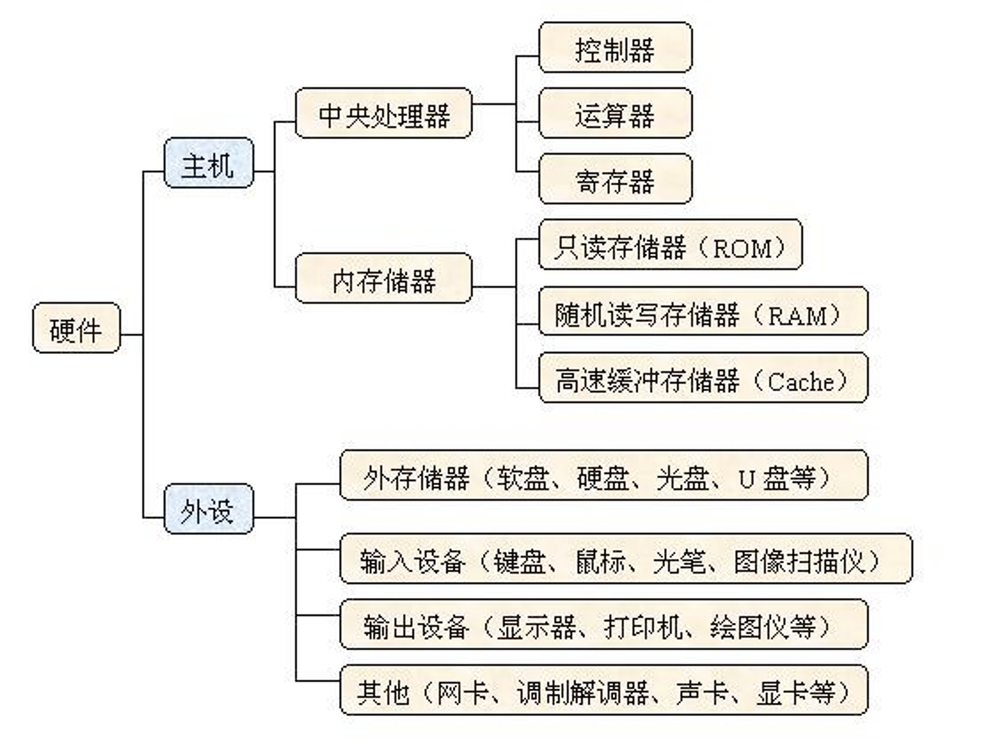
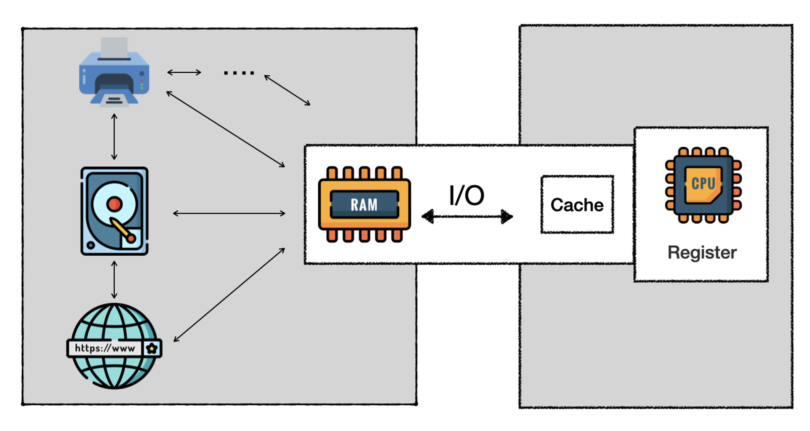

# File & I/O



---

### What is I/O?

- `处理器`访问任何`寄存器`和 `Cache` 等封装以外的数据资源都可以当成 **I/O** 操作，包括`内存`，`磁盘`，`显卡`等外部设备或者`网络`。



### Why do you we non-volatile storage?

- store data after powering off your computer
- store a large mount of data for reuse
- share data among programs

---

### What is streaming?

- build a pipeline to send data in and out
- python use streaming by `default`

```python
file = open(...) # file is a streaming object, it is the pipline between code and the target file
pipeline = open(...) # makes more sense
```

---

### Data Types of  I/O

> You can only **read**/**write** `text` or `binary` data **from**/**into** file.
> 
- Text I/O: for `text` data

```python
f = open("myfile.txt", "rt")
```

- Binary I/O: for `binary` data, `buffered`: music, video

```python
f = open("myfile.jpg", "rb")
```

---

### Buffered and UnBuffered I/O

- send a chunk of data rather than a piece of data
- Raw I/O: for `binary` data, **not** `buffered`, rarely use

```python
f = open("myfile.jpg", "rb", buffering=0)
```

---

### Input: Read

<aside>
💡 You can only read data from `Read` mode (unless you use `+` parameter)

</aside>

- `r`: *Read*. **Default value**
    - read data from the flie if the file exists
    - **error** if the file does `not` exist
    
    ```python
    file = open("words.txt", "r")
    file = open("not-exist.txt") # throw error
    ```
    
    - how to read
    
    ```python
    oneline = file.readline() # read one line
    
    lines = file.readlines() # store each line in an array [l1,l2,l3...ln]
    
    content = file.read() # read all content once
    
    f5 = file.readline(5) # read first 4 characters of the current line
    f5 = file.read(5) # read first 5 characters of all content
    
    for line in file: # for loop
    	print(line)
    
    next(file) # iterator method
    ```
    
    - manipulate the `cursor` (`offset`)
    
    ```python
    # every time you run read txt file using any of above functionalities, the cursor will move downwards.
    # words.txt:
    # ->    1     |
    #       2     |
    #             ↓
    file.open('words.txt') # cursor at 0
    file.readline() # 1
    file.readline() # 2
    file.readline   # nothing!
    
    file.seek(0) # move curosr back to top
    file.tell() # print the current position of the cursor
    ```
    
    - It's `not required` to close the I/O if you are only reading data. But it is `recommended`.
    
    ```python
    file.close()
    ```
    
    - If you want to `auto close` the file
    
    ```python
    with open('words.txt') as file:
    	# your read actions here
      # you don't have to add file.close() any more
    ```
    

---

### Output: Create, Write, Append

<aside>
💡 You can only write data in `Create`, `Write` and `Append` mode unless you use the `+` parameter

</aside>

- `a`:  *Append*.
    - create the file if the file does `not` exist
    - *adding data at the end of the file* if the file already exists
    
    ```python
    file = open("words.txt","a")
    
    file = open("not-exist.txt","a") # will automatically create not-exist.txt in current path
    ```
    
- `w`: *Write*.
    - create the file if the file does `not` exist.
    - clear content of an existing file and *add data at the head of the file*
    
    ```python
    file.open("words.txt","w") # no error
    
    file.open("not-exist.txt","w") # will automatically create nont-exist.txt in current path
    ```
    
- `x`: *Create*
    - create the file if it does `not` exist
    - `error` if the file already exists
    
    ```python
    file.open("file_to_create.txt","x") # will automatically create the file
    
    file.open("words.txt","x") # will throw error if the file already exsits
    ```
    
- how to write data
    
    ```python
    file = open('words',"a")
    
    file.write("hello world") # without newline
    
    file.write("hello \n world") # with newline
    
    file.write(str(1)) # convert to string before writing number into file
    
    file.writeline("hello") # error, no methods for writeline
    
    file.writelines(["hello","world"]) # write any array into file
    ```
    
- It is **required** to use `close`  to save data to file
    
    > `write()` method only writes data into **buffer**, which is a **temporay** space in **memory**. The data will only be store into hard disk(`flushing`) only after you run `close()`
    > 
    
    ```python
    file.close()
    ```
    
- It is very convenient and recommended to use  `with`  to auto close the file
    
    ```python
    with open('words.txt') as file:
    	# your writing action here
    	# you don't have to add file.close() any more
    ```
    

---

### Input/output Mode (Not Recommended)

> **Try to avoid the use of `+`**
> 
- make readable `pipeline` writable, but behave `weired` to write

```python
file = open('words.txt','r+')
# replace different content from top to bottom, if exists, nothing happens
file.write('add something') # no error
file.close()
```

- make appendable `pipeline` readable, but behave `weired` to read

```python
file = open('words.txt','a+')
file.read() # nothing showed since cursor will be automatically moved to the bottom
file.write('line\m') # append to the end
file.close()
```

- make writable/creatable `pipeline` readable

```python
file = open('words.txt','w+')
file.read() # no error but no content
file.close()
```

---

### Summary


- Basic Syntax

```python
pipeline = open('words.txt','rt+')
```

- Auto-close Syntax

```python
with open('words.txt','rt') as pipeline:
	# actions
```

<aside>
💡 open会新建文件， close会保存文件
</aside>