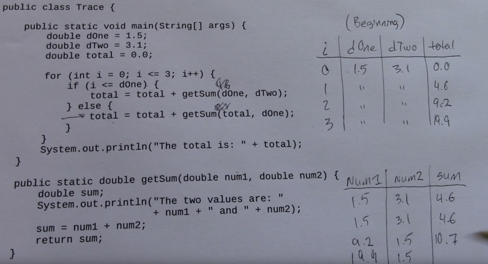

# Jargons

### Code Trace (CT)

- use hand to execute the code!
- put down variables in a table for each function

you may or may not need an ipad for this

---



### Reason over Code

- given an ouput
- reason back to find a input

### Symbolic Computations

- manipulate mathematical expressions in a way similar to the traditional manual computations of mathematicians and scientists.

### Top-down Design

- A top-down design is the **decomposition** of a system into **smaller** parts in order to comprehend its compositional sub-systems.

### Imperative Programming

- Tell computer how to do things **写包**

```jsx
var array = [1,2,3]
var output = []
for(var i = 0; i < array.length; i++) 
{
  var tmp = array[i] * 2
  output.push (tmp)
}
console.log (output) //=> [2,4,6]
```

### Declarative Programming

- Tell computer your requirements and let computer get there by itself **调包**

```jsx
var array = [1,2,3,]
var output = array.map (function (n) 
{
  return n * 2
})
console.log (output) //=> [2,4,6]
```

### First-class Function

- same level as other variables
- you can use function the same way you use  a variable, ex. passing into another function

### Statement vs Expression

- statement: a line of code that performs an **action.**
- expression: a data value or an operation that **evaluates to a value**.